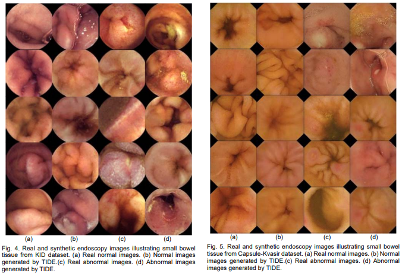

# This Intestine Does Not Exist: Multiscale Residual Variational Autoencoder for Realistic Wireless Capsule Endoscopy Image Generation 

[](https://github.com/innoisys/TIDE/)

[](README.md)
[](https://www.gnu.org/licenses/gpl-3.0)

This is the official <b>Tensorflow</b> implementation of ["This Intestine Does Not Exist: Multiscale Residual Variational Autoencoder for Realistic Wireless Capsule Endoscopy Image Generation"](https://ieeexplore.ieee.org/document/10438422) also known as "TIDE".  

<div align="center">
  
</div>

## Abstract 
Medical image synthesis has emerged as a promising solution to address the limited availability of annotated medical data needed for training machine learning algorithms in the context of image-based Clinical Decision Support (CDS) systems. To this end, Generative Adversarial Networks (GANs) have been mainly applied to support the algorithm training process by generating synthetic images for data augmentation. However, in the field of Wireless Capsule Endoscopy (WCE), the limited content diversity and size of existing publicly available annotated datasets adversely affect both the training stability and synthesis performance of GANs. In this paper a novel Variational Autoencoder (VAE) architecture is proposed for WCE image synthesis, namely ‘This Intestine Does not Exist’ (TIDE). This is the first VAE architecture comprising multiscale feature extraction convolutional blocks and residual connections. Its advantage is that it enables the generation of high-quality and diverse datasets even with a limited number of training images. Contrary to the current approaches, which are oriented towards the augmentation of the available datasets, this study demonstrates that using TIDE, real WCE datasets can be fully substituted by artificially generated ones, without compromising classification performance of CDS. It performs a spherical experimental evaluation study that covers both quantitative and qualitative aspects, including a user evaluation study performed by WCE specialists, which validate from a medical viewpoint that both the normal and abnormal WCE images synthesized by TIDE are sufficiently realistic. The quantitative results obtained by comparative experiments validate that the proposed architecture outperforms the state-of-the-art.

### Website: 
https://this-intestine-does-not-exist.com/

### Article: 
https://ieeexplore.ieee.org/document/10438422

### Supplementary material: 
https://github.com/innoisys/TIDE/blob/main/sampled-kvasir-capsule-filenames.txt

### Citation: 
Diamantis, D. E., Gatoula, P., Koulaouzidis, A., & Iakovidis, D. K. (2024). This intestine does not exist: Multiscale residual variational autoencoder for realistic wireless capsule endoscopy image generation. IEEE Access, 12, 25668-25683.
#### BibTeX
```
@ARTICLE{10438422,
  author={Diamantis, Dimitrios E. and Gatoula, Panagiota and Koulaouzidis, Anastasios and Iakovidis, Dimitris K.},
  journal={IEEE Access}, 
  title={This Intestine Does Not Exist: Multiscale Residual Variational Autoencoder for Realistic Wireless Capsule Endoscopy Image Generation}, 
  year={2024},
  volume={12},
  number={},
  pages={25668-25683},
  keywords={Image synthesis;Training;Endoscopes;Lesions;Magnetic resonance imaging;Generative adversarial networks;Decision support systems;Clinical diagnosis;Gastroenterology;Gastrointestinal tract;Encoding;Biomedical monitoring;Clinical decision support systems;endoscopy;gastrointestinal tract;image synthesis;variational autoencoders},
  doi={10.1109/ACCESS.2024.3366801}}
```
